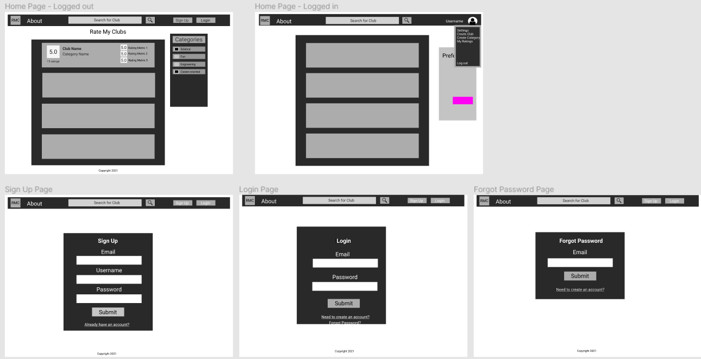
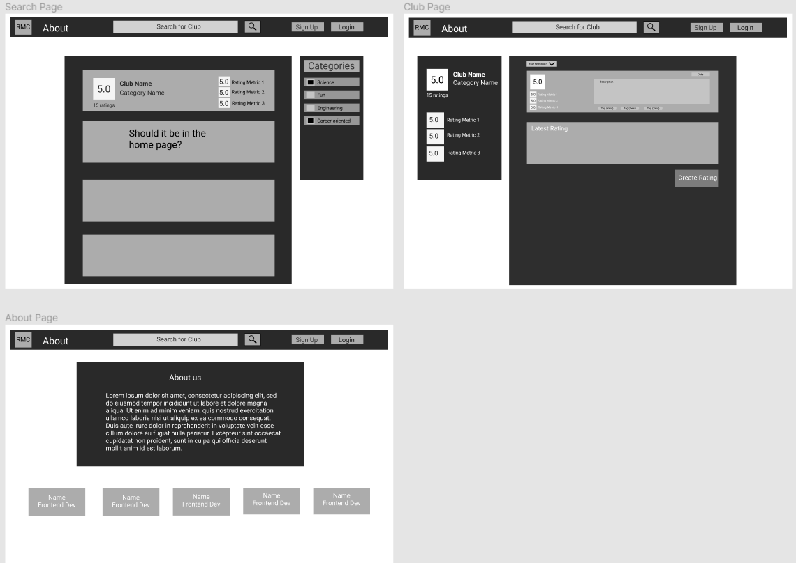
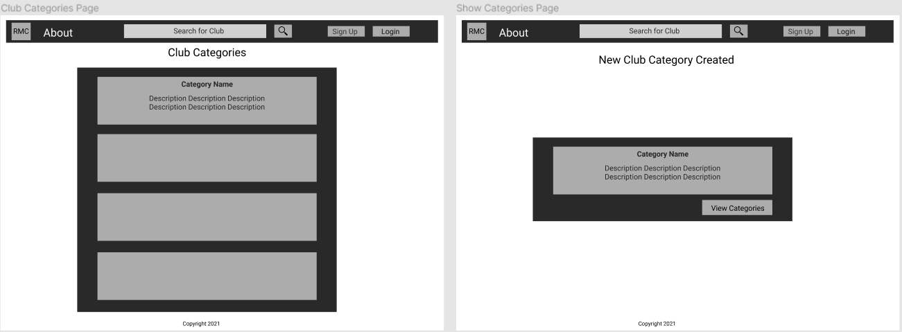

# Rate My Clubs (RMC)

## Table of Contents
1. [Overview](#Overview)
1. [Deployment](#Deployment)
1. [Installation](#Installation)
1. [Product Spec](#Product-Spec)
1. [Wireframes](#Wireframes)
1. [Schema](#Schema)

## Overview
### Description
Like Rate My Professors, but with clubs! This web service allows users to create and view clubs, add and view ratings, and search and filter clubs based on category or name. This application is for a semester-long group project in CS 4800 - Software Engineering at California State Polytechnic University, Pomona.

### App Evaluation
- **Category:** Review App / Academia
- **Mobile:** This app would be primarily developed for desktop but is just as viable on a mobile device.
- **Story:** Displays clubs for users to click on to view the club page. From there, logged in users can add ratings to that particular club.
- **Market:** The target audience is college students who want to view and rate clubs.
- **Habit:** This app could be used as often or unoften as the user wants. Users who are not logged in can view clubs, but cannot create ratings.

## Deployment
The web service is deployed on Heroku:
[https://lit-savannah-91482.herokuapp.com/](https://lit-savannah-91482.herokuapp.com/)

## Installation
### Requirements
* Ruby version: 2.7.2
* Ruby on Rails version: 6.1.4.1
* Development and Test Database: SQLite3
* Production Database: PostgreSQL
* NPM
* YARN

### Steps to Run the App
1. Run the following commands in the directory the project is in:
```
bundle install
npm install
bin/rails db:migrate
```
2. To run the server, do the following command:
```
bin/rails server
```
3. Open your local host URL in a web browser: 
[http://localhost:3000/](http://localhost:3000/)

## Product Spec
### 1. User Stories

#### Stories that Do NOT Require Login

* User filters clubs based on their categories
* Can search for clubs by name
* View club pages by clicking on club cards on the Home Page
* User can create an account, verify the account through an Email and login

#### Stories that Do Require Login

* User can log out
* Can create club categories
* Can create clubs
* Can create ratings
* View user's personal ratings (My Ratings Page)
* Settings (Change username, Email address, password; Delete account)

### 2. Page Archetypes

* Home Page - Displays all clubs created
   * Club cards are displayed with number of ratings, overall, career-oriented, enjoyment, and community ratings from a scale from 1 to 5. Club name and category are also displayed.
   * Users can select club cards to navigate to the club's page.
   * Categories sidebar allows the user to filter clubs based on category.
   * Search functionality in the navigation bar allows users to find clubs based on club name.
* Club Page - Specific club page for a certain club based on name.
   * Displays overall, career-oriented, enjoyment, and community ratings.
   * Displays club name and category the club is in.
   * Displays all user-created ratings for the club with creation date, overall, career-oriented, enjoyment, and community ratings, and description. For specific user's rating, there will be a "Destroy Rating" button.
   * Prompts user with a form to create a rating of their own if the user is signed in and does not already have a rating themselves.
* Login Page
* Sign Page - User signs up by inputting a username, Email, and password.
   * An Email to verify the user's account creation will be sent.
* About Page
   * Displays information on the team of developers
   * Allows users to navigate off the site to the GitHub link and our class's Team webpage.
* Club Categories Page
   * Displays all user-created club categories with descriptions
   * Allows signed in users to navigate to a new page to create a new category.
* Create Club Page
   * Displays a form for the user to create a new club.
   * Requires club name and a user-created category to create.
* Create Categories Page
   * Displays a form for the user to create a new category.
   * Requires category name and a description to create.
* My Ratings Page
   * Displays all ratings the user had created for each associated club.
   * Club name and it's overall rating are displayed on the left.
   * It's associated rating is displayed on the right.
   * Users can "Destroy Rating" which will navigate to the club page.
* Settings Page
   * Lets users change their username, Email, and password.
   * Users can also delete their account.

### 3. Navigation

**Navigation Bar**

* Logo - Home Page
* About
* Club Categories
* Search Bar - Goes/Stays on Home Page

#### Signed Out

* Sign In
* Login

#### Signed In

* Create Club
* Create Category
* My Ratings
* Settings
* Logout

**Flow Navigation** (Page to Page)
* Home Page ->
   * Club Page
   * About ->
     * GitHub Link
     * Developer Link
   * Club Categories -> Create Category -> New Category Created -> Club Categories
   * Sign Up -> Sign Up Page -> Home Page
   * Login -> Login Page -> Home Page
   * Create Club -> Create Club Page -> Club Page
   * Create Category -> New Category Created -> Club Categories
   * My Ratings -> Club Page
   * Settings -> Settings Page -> Home Page
   * Logout -> Home Page

## Wireframes
<br>
<br>
<br>
<br>

## Schema 
### Models

#### Categories

   | Property      | Type     | Description |
   | ------------- | -------- | ------------|
   | id            | String   | unique id for the user post (default field) |
   | name          | String   | name of club category |
   | description   | Text     | description of club category |
   | created_at     | DateTime | date when post is created (default field) |
   | updated_at     | DateTime | date when post is last updated (default field) |

#### Clubs

   | Property      | Type     | Description |
   | ------------- | -------- | ------------|
   | id            | String   | unique id for the user post (default field) |
   | name          | String   | name of club |
   | overall_rating| Decimal  | saved overall rating which updates when new user-created club ratings are created (default value: -1) |
   | career_oriented_rating| Decimal| saved career-oriented rating which updates when new user-created club ratings are created (default value: -1) |
   | enjoyment_rating| Decimal| saved enjoyment rating which updates when new user-created club ratings are created (default value: -1) |
   | community_rating| Decimal| saved community rating which updates when new user-created club ratings are created (default value: -1) |
   | created_at     | DateTime | date when post is created (default field) |
   | updated_at     | DateTime | date when post is last updated (default field) |
   | category_id   | String   | unique category id associated as a foreign key to the club model instance |

#### Ratings

   | Property      | Type     | Description |
   | ------------- | -------- | ------------|
   | id            | String   | unique id for the user post (default field) |
   | description   | Text     | description of user-created club rating |
   | general_rating| Decimal  | saved general rating which updates the club's overall rating |
   | career_oriented_rating| Decimal| saved career-oriented rating which updates the club's career-oriented rating |
   | enjoyment_rating| Decimal| saved enjoyment rating which updates the club's enjoyment rating |
   | community_rating| Decimal| saved community rating which updates the club's community rating |
   | created_at     | DateTime | date when post is created (default field) |
   | updated_at     | DateTime | date when post is last updated (default field) |
   | club_id       | String   | unique club id associated as a foreign key to the rating model instance |
   | user_id       | String   | unique user id associated as a foreign key to the rating model instance |

#### Users

   | Property      | Type     | Description |
   | ------------- | -------- | ------------|
   | id            | String   | unique id for the user post (default field) |
   | username      | String   | username of the user |
   | email         | String   | email of the user |
   | encrypted_password| String  | password of the user encrypted by the Devise library |
   | reset_password_token| String| token used to reset the user's password |
   | reset_password_sent_at| DateTime| saves date when the user last reset their password |
   | remember_created_at| DateTime| Devise's date when post is created |
   | confirmation_token| String| token used to confirm the user after user signed up |
   | confirmed_at| DateTime| saves date when the user clicked the confirmation link in their email after signing up |
   | confirmation_sent_at| DateTime| saves date when the user had just signed up and a confirmation_token has been generated |
   | unconfirmed_email| String| an email address copied from the email attr. |
   | created_at     | DateTime | date when post is created (default field) |
   | updated_at     | DateTime | date when post is last updated (default field) |
